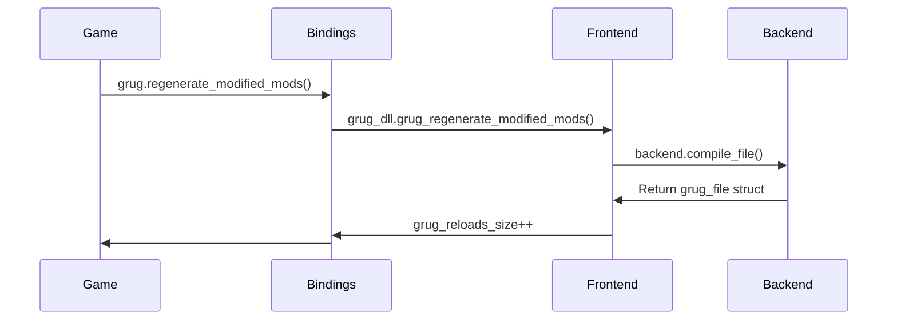
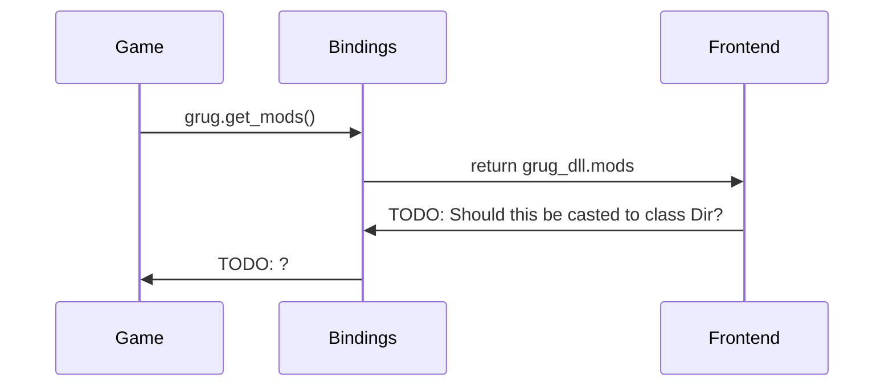

# Swappable grug backend

## Running the program

1. Clone this repository and open it in VS Code.
2. Hit `F5` to run the program.

## Explanation

```mermaid
sequenceDiagram
    Game->>Bindings: grug.regenerate_modified_mods()
    Bindings->>Frontend: grug_dll.grug_regenerate_modified_mods()
    Frontend->>Backend: backend.compile_file()
    Backend->>Frontend: Return grug_file struct
    Frontend->>Bindings: grug_reloads_size++
    Bindings->>Game: 
```

```mermaid
sequenceDiagram
    Game->>Bindings: grug.get_mods()
    Bindings->>Frontend: return grug_dll.mods
    Frontend->>Bindings: TODO: Should this be casted to class Dir?
    Bindings->>Game: TODO: ?
```
